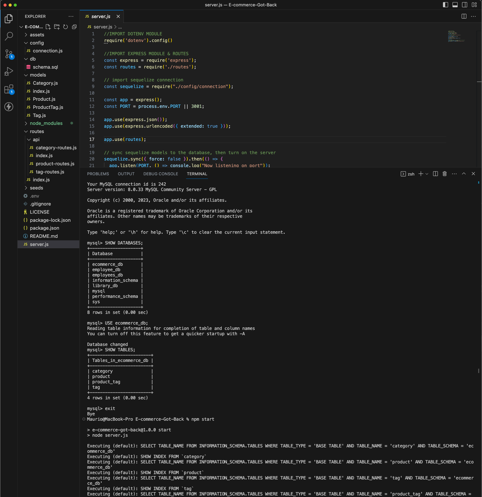
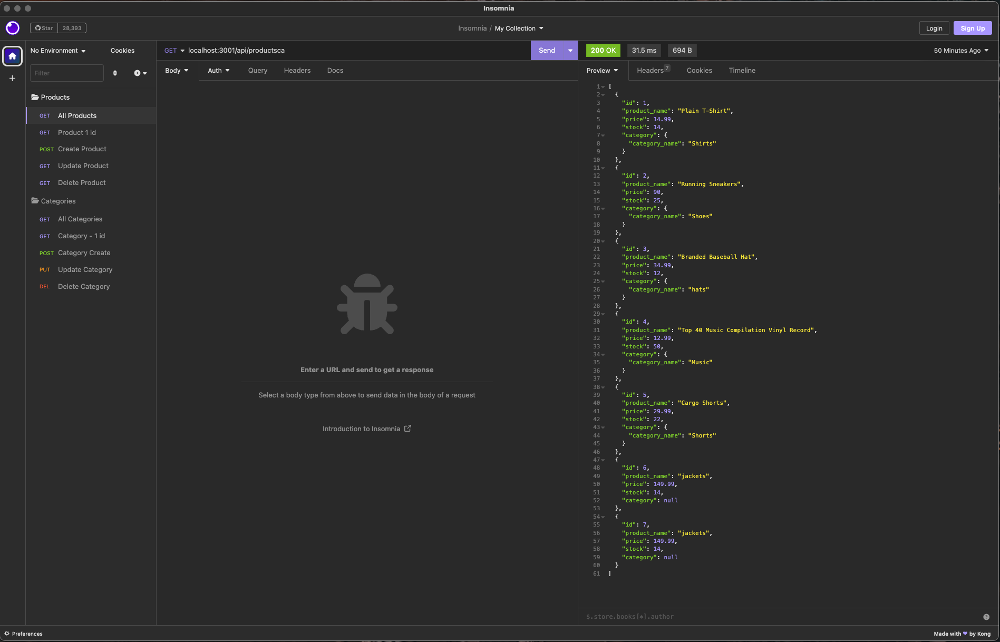
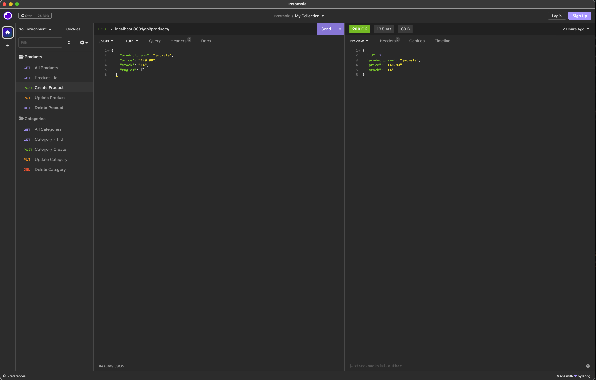
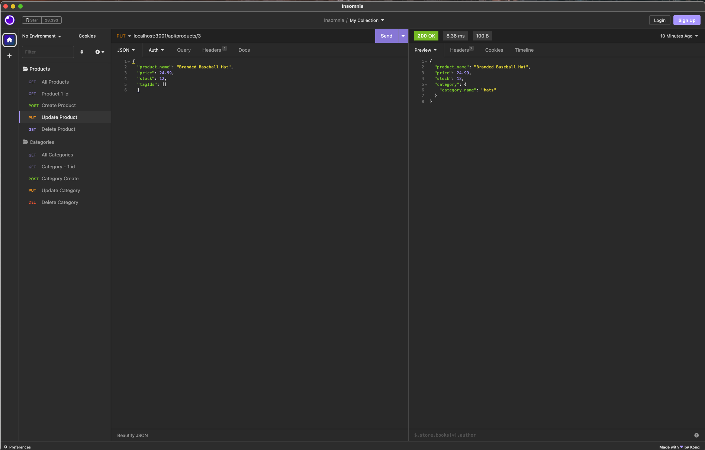
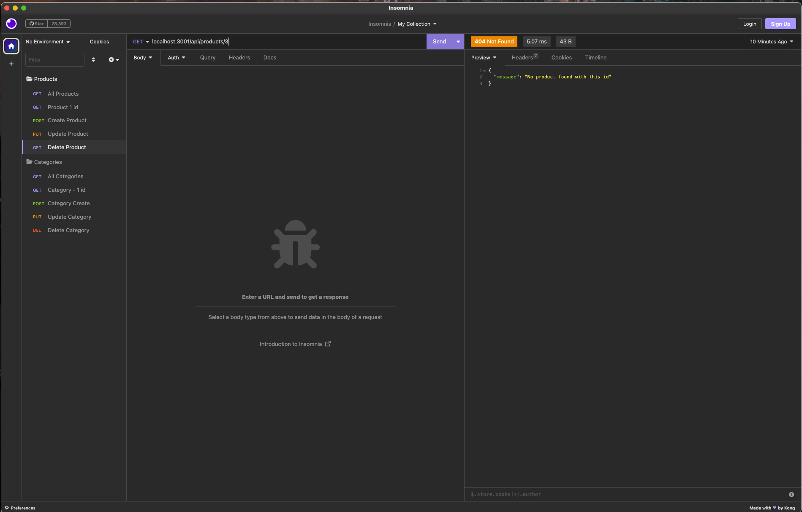

# E-commerce-Got-Back
The back end for an e-commerce site (ORM). This uses Express.js API and configure it to use Sequelize to interact with a MySQL database.

## Table of Contents

- [Description](#description)
- [User Story](#user-story)
- [Acceptance Criteria](#acceptance-criteria)
- [Preview Images](#preview-images) 
- [Link To Walkthru Video](#link-to-walkthru-video)
- [Installation and Usage](#installation-and-usage)
- [Tests](#tests)
- [Technologies Used](#technologies-used)
- [Credits](#credits)
- [License](#license)

## Descriptiom

E-commerce platforms like Shopify and WooCommerce provide a suite of services to businesses of all sizes. Due to the prevalence of these platforms, developers should understand the fundamental architecture of e-commerce sites.

The challenge was to build the back end for an e-commerce site. Which will take a working Express.js API and configure it to use Sequelize to interact with a MySQL database.

## User Story

```md
AS A manager at an internet retail company
I WANT a back end for my e-commerce website that uses the latest technologies
SO THAT my company can compete with other e-commerce companies
```

## Acceptance Criteria

```md
GIVEN a functional Express.js API
WHEN I add my database name, MySQL username, and MySQL password to an environment variable file
THEN I am able to connect to a database using Sequelize
WHEN I enter schema and seed commands
THEN a development database is created and is seeded with test data
WHEN I enter the command to invoke the application
THEN my server is started and the Sequelize models are synced to the MySQL database
WHEN I open API GET routes in Insomnia Core for categories, products, or tags
THEN the data for each of these routes is displayed in a formatted JSON
WHEN I test API POST, PUT, and DELETE routes in Insomnia Core
THEN I am able to successfully create, update, and delete data in my database
```

## Preview Images
- ## Preview 1 - Terminal

- ## Preview 2 - GET

- ## Preview 3 - POST

- ## Preview 4 - PUT

- ## Preview 5 - DELETE


## Link To Walkthru Video
**Walkthrough Video:** [Link To Walkthru Video](https://youtu.be/N3OneFKybxs) 


## Installation and Usage
- To clone the repo: https://github.com/cynthiamory/E-commerce-Got-Back.git
- Install [Node](https://nodejs.org/en). version 16 and up. Command line: npm init 
- Install [Sequelize](https://www.npmjs.com/package/sequelize). version 16 and up. Command line: npm i sequelize 
- Install Express: [Version 4.17.1](https://www.npmjs.com/package/express) Command line: npm i express@4.17.1
- Then install MySQL2: [Version 3.1.2](https://www.npmjs.com/package/mysql2) Command line: npm i mysql2
- Install nodemon: [Version 2/0/22](https://www.npmjs.com/package/nodemon) Command line: npm i nodemon
- dotenv: [dotenv 16.1.4](https://www.npmjs.com/package/dotenv) Command line: npm install dotenv --save
- Run the application using Command: 
```bash
node server.js
```
```bash
npm start
```

- Add your .env file in the root directory of the repo. Here you will pass your database name, your mySQl user and password. This will need to be done before running the app to allow a the connection.js to use the enviromental variables and keep your credentials protected.
- Create your database. Navigate to the db Directory which holds the schema.sql file. Then you will need to open the MySQL Shell by running the command line: 
```bash
mysql -u root -p 
```
in your terminal. When prompted, enter your password.
- Now, run your schema.sql file to create the database by using the command: 
```bash
SOURCE Schema.sql
```
- Now you will need to seed your database. Navigate your your root directory and use the command:
```bash
npm run seed.
```
- Once completed, you may now run the command: 
```bash
npm start
```
to initiate the server.
- Now you can leverage Insomnia to test the functionality of the routes in the application.


## Tests
- There are no tests yet for this application

## Technologies Used
Assignment was built with:


## Credits
- E-commerce Got Back: Cynthia Morales - Full Stack Developer Student
- Institution: The University Of Toronto
- Course: Bootcamp Full Stack Development
- Instructor: Ali Masqood
- Tutor: Jose Lopez 
- Learing Assistant Ask BCS Support: Ntando (nmendu)
- Online Support: W3Schools, Youtube, SQL Shack, mySQL, Stack Overflow, Sequelize.org
- License badges: Sheilds.io


## License


